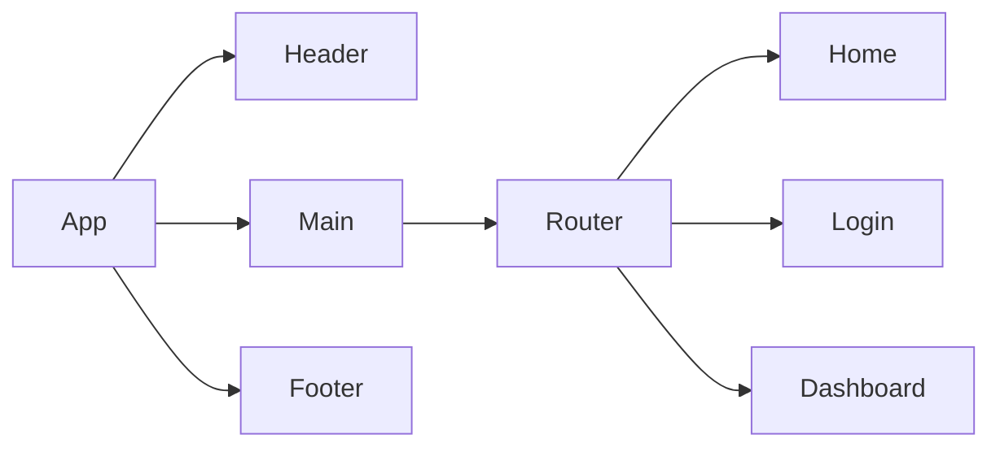

*A PRD (Product Requirements Document) is created before creating a product or feature and includes the planning required for developers to execute effectively. This document is usually prepared by Product Managers, read more [here](https://www.atlassian.com/agile/product-management/requirements)*

# Product Requirements Documentation

**Summary**
| Field | Detail |
|-------|--------|
| Project Name | Prototype|
| Description | This app seeks to provide a searchable Monster index of Dungeons and Dragons 5th Edition. |
| Developers | Kyle Canamar |
| Live Website | {website of deployed application} |
| Repo | [GitRepo](https://github.com/kcanamar/dnd5e_monsters) |

## Problem Being Solved and Target Market

As a Dungeon Master having a visual database of all creatures at your fingertips will help drive great stories.

## User Stories

List of stories users should experience when using your application.

- users can search the monsters in Dungeons and dragon 5th edition
 
## Route Tables

For backend Applications you'll want to detail the different routes and types of your request your server can receive. There are three main things to define.

- The endpoint: https://www.dnd5eapi.co/api/
- The method: jQuery
- The response: what the response should be, a web page, json data, etc.

## Component Architecture

You can use the [Mermaid Markdown Syntax](https://mermaid-js.github.io/mermaid/#/flowchart) to create a chart of how the parts of your frontend website relate to each other. Units should represent components of your page. The following is an example you may see in a Single Page Application like a React App.

## User Interface Mockups

Original mock up [Wireframe](./wireframe.png).
Current mock up [Update](./update-wireframe.png).

#### Screenshots

Page at initialization [Load](./page_load.png)
Input Functionality [Input](./page_user_input.png), [Search](./page_search_success.png)
Search functionality [Scroll](./page_scroll_display.png)